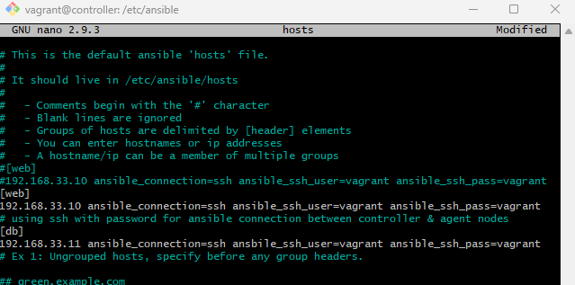

# Tech 201 Infrastructure as Code

## What is Infrastructure as Code? (IaC)
Infrastructure as Code is the managing and provisioning of IT infrastructure through code as opposed to manual processes.
With IaC, configuration files are created that contain your infrastructure specifications, which makes it easier to edit and distrubute configurations.

### Types of IaC
There are various ways to have IaC, these include the following:
- **Scripts** - A very direct form of IaC, typically used for simple or one-off tasks.
- **Configuration management tools** - Thes tools implement automation by installing and configuring servers. This type of IaC is designed for more complex tasks as these are specialized tools built to manage software. This is the most common type of IaC and one of the most well known examples is Ansible.
- **Provisioning tools** - This type of has more advantages in complex tasks. These tools implement automation by creating infrastructure.
- **Containers and templating tools** - These tools formulate templates and images pre-loaded with all the libraries and components to run and application. Data distributed with these tools are easy to manage and have a lower overhead compared to running an entire server.

### Why should we use IaC?
Provisioning infrastructure has historically been a time consuming and costly manual process. Adopting a code-based approach makes it easier for organisations to do more in less time.

## Benefits of IaC
Here are some of the benefits of IaC:

### Cost reduction
Every task done contributes to the heavy financial budget of every building team. Most times, the time taken to complete the task results in high pricing. However, since significant tasks, like time-consuming infrastructure configuration, are automated by IaC, the engineers can finish these tasks in no time and focus on other mission-critical tasks.

### Speed
There are many processes in building, monitoring, and managing infrastructure structures, but as IaC has made it possible to automate almost every process, the work can be two times faster. Automation stretches from significant procedures like virtualization to user account management, databases, network management, and even minor operations like adding environments and resources when needed or shutting down when it is not the case. This automation feature promises faster and simpler procedures.

### Reduced human error
On this benefit, there are two descriptions of human errors. The first is the face meaning which implies mistakes made by engineers or IT personnel in the manual process of infrastructure building. The second side to human error is the adaptation of new employees to the infrastructure built by the former IT expert. IaC solves these two issues as automation reduces the risks of human-made mistakes by cutting down long processes. 

### Improved consistency
Infrastructure as Code aids consistency as it helps avoid human errors and incompatibility in activities, like deployment and configuration. IaC improves consistency during these activities by preventing waste of valuable resources, unwanted downtime, and setbacks that can cause inconsistencies in the configuration.

### Eliminating configuration drift
Another critical benefit of infrastructure as code is that it is idempotent. This implies that one can deploy the code many times, with the first deployment being the actual deployment and subsequent deployments having no essential effect.

### Stable and scalable environment
Using IaC, teams can configure their environments according to their specifications rapidly and at scale. As stated earlier, they can also create these environments with sure consistency as they can deploy the configuration several times. These several deployments also make the environment stable, preventing incompatibility caused by configuration drift or missing dependencies.

## Configuration Management
Configuration Management is the process of maintaining systems, such as computer hardware and software, in a desired state. Configuration Management is also a method of ensuring that systems perform in a manner consistent with expectations over time.

## Orchestration
Orchestration is the automated configuration, management, and coordination of computer systems, applications, and services. Orchestration helps IT to more easily manage complex tasks and workflows.

IT teams must manage many servers and applications, but doing so manually isn’t a scalable strategy. The more complex an IT system, the more complex managing all the moving parts can become. The need to combine multiple automated tasks and their configurations across groups of systems or machines increases. That’s where orchestration can help.

## IaC Tools
There are a variety of tools that are used to implement IaC, here are some of the best tools for IaC in 2022:
- Terraform
- Ansible
- AWS CloudFormation
- Azure Resource Manager
- Google Cloud Deployment Manager
- Chef
- Puppet
- SaltStack

### Terraform
Terraform is and IaC tool that lets you define both cloud and on-prem resources in human-readable configuration files that you can version, reuse, and share.
You can then use a consistent workflow to provision and manage all of your infrastructure throughout its lifecycle.

### Ansible
Ansible is an IaC tool used for configuration management. With Ansible, organisations are able perform complex tasks accross a network of machines with relative ease. Ansible has several advantages over similar tools like Chef or Puppet, due to its playbooks being written in YAML, which are both human readable and computationally powerful, also Ansible is agentless, meaning it doesn't need to be installed on target machines.

# Using Ansible Controller with 3 VMs


Firstly we will create a vagrantfile with the following code to setup 3 Virtual Machines in Virtual Box.
```Ruby
# MULTI SERVER/VMs environment 
 #
 Vagrant.configure("2") do |config|
 # creating are Ansible controller
   config.vm.define "controller" do |controller|
     
    controller.vm.box = "bento/ubuntu-18.04"
    
    controller.vm.hostname = 'controller'
    
    controller.vm.network :private_network, ip: "192.168.33.12"
    
    # config.hostsupdater.aliases = ["development.controller"] 
    
   end 
 # creating first VM called web  
   config.vm.define "web" do |web|
     
     web.vm.box = "bento/ubuntu-18.04"
    # downloading ubuntu 18.04 image
 
     web.vm.hostname = 'web'
     # assigning host name to the VM
     
     web.vm.network :private_network, ip: "192.168.33.10"
     #   assigning private IP
     
     #config.hostsupdater.aliases = ["development.web"]
     # creating a link called development.web so we can access web page with this link instread of an IP   
         
   end
   
 # creating second VM called db
   config.vm.define "db" do |db|
     
     db.vm.box = "bento/ubuntu-18.04"
     
     db.vm.hostname = 'db'
     
     db.vm.network :private_network, ip: "192.168.33.11"
     
     #config.hostsupdater.aliases = ["development.db"]     
   end
 
 
end
```
Then we will use vagrant up to spin up our 3 VMs: `controller`, `web`, `db`. Once our machines are up we need to run the following commands for each machine (we will ssh into each VM to do this):
```
sudo apt update
sudo apt upgrade
```
In our `controller` machine we run the following commands:
```
sudo apt-get install software=properties-common
```
and 
```
sudo apt-add-repository ppa:ansible/ansible
```
Then to install ansible on our controller:
```
sudo apt-get install ansible
```
If we enter `ansible --version` within our controller machine we should get `ansible 2.9.27` in our output.

We then navigate to our hosts file
```
cd /etc/ansible/hosts
```
In hosts, we update the file to include this line to allow the controller to connect to our `web` machine
```
[web]
192.168.33.10 ansible_connection=ssh ansible_ssh_user=vagrant ansible_ssh_pass=vagrant
```
Then we want to update the ansible configuration file (should be in the same directory) and uncomment the following line:
```
host_key_checking = False
```
Following which we run the command
```
sudo ansible -m ping web
```
If we get the following in our output
```
192.168.33.10 | SUCCESS => {
    "ansible_facts": {
        "discovered_interpreter_python": "/usr/bin/python"
    },
    "changed": false,
    "ping": "pong"
}
```
This verifies that our controller is able to connect to our `web` machine.


# Making Ansible Playbooks in YAML files
We start making our Ansible playbooks by navigating to the following directory: `/etc/ansible`

Inside the directory we create our playbook to configure Nginx serve in our web machine


We can then run our playbook via the command:
```
sudo ansible-playbook nginx-playbook.yaml
```
We should then get the following output:


If we then enter the IP of the `web` machine in our browser (192.168.33.10) we can see that our nginx server is running.

Now that our Nginx server is running on our machine we can create another playbook to install and run our app.


### Create a playbook to configure/install mongodb in our db machine
We create the following simple playbook:


When we run the playbook ansible will check its `hosts` file (in `/etc/ansible`) to verify that it has the host, in this case db.



We can check the status of mongodb in our `db` machine from our `controller` machine with
```
sudo ansible db -a "systemctl status mongodb" --ask-vault-pass
```
This spares us from having to ssh into the actual `db` machine which can be time consuming when we are configuring multiple machines.

If everything is alright, we ssh into `db` directly from `controller`:
```
ssh vagrant@192.168.33.11
```
The IP here is the IP of our `db` machine.
Then we need to navigate to the mongodb configuration file in the /etc directory. The file is `mongodb.conf`. We then edit the BindIp to 0.0.0.0 to allow a connection from anywhere and then we apply this change via.
```
sudo systemctl restart mongodb
```
Once this is done we then enter our `web` machine and navigate to our `app` folder where we run `npm install` and we then create an environment variable called `DB_HOST=db-ip`. We should then simply be able to run `npm start` to get the app running and listening on port 3000. 

# Automate the process of creating and EC2 Instance
What we want to do is launch an EC2 instance via an Ansible Playbook.

## Ansible-Vault
Ansible provides security through ansible-vault with the following folder structure:
```
/etc/ansible/group_vars/all/pass.yml
```
Here we store the keys we want to access AWS, we'll call them `aws_access_key` and `aws_secret_key` and give our ssh key permissions via `sudo chmod 400 file.pem`.

To run the command to execute the playbook we need the following
```
sudo ansible-playbook ec2.yml --ask-vault-pass --tags create_ec2
```
Must include `--ask-vault-pass` to prompt us to provide a password that we set up, otherwise the command will not work.

### Setting up our vault

```
sudo vi test.txt
```
Need to get to `INSERT` mode, then to save vim file: esc > wq! > press enter.

We may want to install `tree`, a useful tool for linux
```
sudo apt install tree
```

We'll create a `group_vars` folder and then an `all` folder inside

```
sudo mkdir group_vars
cd group_vars
sudo mkdir all
```
In all we then run the command
```
sudo ansible-vault create pass.yaml
```
You will be prompted to create a password.

We will need to use  
```
--ask-vault-pass
```
after some of our commands moving forward

### Creating an Ansible Playbook to launch an EC2 Instance on AWS


# Terraform
## Installing Terraform
Video guide: https://www.youtube.com/watch?v=SkcRSJWNRS8

We can verify if Terraform is installed by running `terraform --version`

We expect
```
Terraform v1.3.9
on windows_amd64
```

## Using Terraform 


To use Terraform we create a configuration file, `main.tf`.

Note: Ensure to install Terraform extensions on VS Code


In `main.tf` we will write code to launch an EC2 Instance on AWS:
```ruby
# launch ec2
# which cloud provider - AWS
# terraform downloads required dependencies -
# terraform init 

provider "aws" {
    region = "eu-west-1"

}

# MUST OPEN NEW GITBASH AS ADMIN AFTER ENV VAR SET UP
# launch an instance
resource "aws_instance" "app_instance" {
    ami = "ami-0f69657a120c6f174"
    instance_type = "t2.micro"
    associate_public_ip_address = true
    tags = {
        Name = "tech201-iwan-terraform-app"
    }
}
```
To install the dependencies required to launch an instanc on AWS we run `terraform init`. Once this is done we can run the following

```
terraform plan
```
This creates an execution plan, which lets you preview the changes that Terraform plans to make to your infrastructure. When Terraform creates a plan it:
- Reads the current state of any already-existing objects to ensure the Terraform state is up-to-date
- Compares the current configuration to the prior state and noting any differences
- Proposes a set of change actions that should make the remote objects match the configuration.

It is important that AWS access keys are saved properly to your machine's environment variables (User variables specifically) in advanced system settings on your local machine. If we don't have the correct access we may get the following when running `terraform plan`


Note you may just need to open a new bash terminal (AS ADMIN) to get this working.

If everything looks alright we execute our Terraform plan by running
```
terraform apply
```
In this case we should see our EC2 Instance launched as specified in our file `main.tf`

And should we wish to terminate our EC2 instance we run:
```
terraform destroy
```


# Sources
https://www.redhat.com/en/topics/automation/what-is-infrastructure-as-code-iac#:~:text=choose%20Red%20Hat%3F-,Overview,to%20edit%20and%20distribute%20configurations.

https://www.spiceworks.com/tech/cloud/articles/what-is-infrastructure-as-code/

https://www.vmware.com/topics/glossary/content/configuration-management.html#:~:text=Configuration%20Management%20is%20the%20process,consistent%20with%20expectations%20over%20time.

https://www.redhat.com/en/topics/automation/what-is-orchestration#:~:text=Orchestration%20is%20the%20automated%20configuration,isn't%20a%20scalable%20strategy.

https://www.xenonstack.com/blog/infrastructure-as-code-tools

https://developer.hashicorp.com/terraform/intro