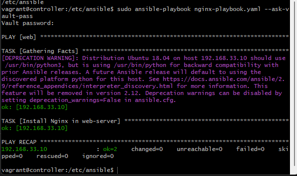

# Tech 201 Ansible

## Using Ansible Controller with 3 VMs


Firstly we will create a vagrantfile with the following code to setup 3 Virtual Machines in Virtual Box.
```Ruby
# MULTI SERVER/VMs environment 
 #
 Vagrant.configure("2") do |config|
 # creating are Ansible controller
   config.vm.define "controller" do |controller|
     
    controller.vm.box = "bento/ubuntu-18.04"
    
    controller.vm.hostname = 'controller'
    
    controller.vm.network :private_network, ip: "192.168.33.12"
    
    # config.hostsupdater.aliases = ["development.controller"] 
    
   end 
 # creating first VM called web  
   config.vm.define "web" do |web|
     
     web.vm.box = "bento/ubuntu-18.04"
    # downloading ubuntu 18.04 image
 
     web.vm.hostname = 'web'
     # assigning host name to the VM
     
     web.vm.network :private_network, ip: "192.168.33.10"
     #   assigning private IP
     
     #config.hostsupdater.aliases = ["development.web"]
     # creating a link called development.web so we can access web page with this link instread of an IP   
         
   end
   
 # creating second VM called db
   config.vm.define "db" do |db|
     
     db.vm.box = "bento/ubuntu-18.04"
     
     db.vm.hostname = 'db'
     
     db.vm.network :private_network, ip: "192.168.33.11"
     
     #config.hostsupdater.aliases = ["development.db"]     
   end
 
 
end
```
Then we will use vagrant up to spin up our 3 VMs: `controller`, `web`, `db`. Once our machines are up we need to run the following commands for each machine (we will ssh into each VM to do this):
```
sudo apt update
sudo apt upgrade
```
In our `controller` machine we run the following commands:
```
sudo apt-get install software=properties-common
```
and 
```
sudo apt-add-repository ppa:ansible/ansible
```
Then to install ansible on our controller:
```
sudo apt-get install ansible
```
If we enter `ansible --version` within our controller machine we should get `ansible 2.9.27` in our output.

We then navigate to our hosts file
```
cd /etc/ansible/hosts
```
In hosts, we update the file to include this line to allow the controller to connect to our `web` machine
```
[web]
192.168.33.10 ansible_connection=ssh ansible_ssh_user=vagrant ansible_ssh_pass=vagrant
```
Then we want to update the ansible configuration file (should be in the same directory) and uncomment the following line:
```
host_key_checking = False
```
Following which we run the command
```
sudo ansible -m ping web
```
If we get the following in our output
```
192.168.33.10 | SUCCESS => {
    "ansible_facts": {
        "discovered_interpreter_python": "/usr/bin/python"
    },
    "changed": false,
    "ping": "pong"
}
```
This verifies that our controller is able to connect to our `web` machine.


## Making Ansible Playbooks in YAML files
We start making our Ansible playbooks by navigating to the following directory: `/etc/ansible`

Inside the directory we create our playbook to configure Nginx serve in our web machine


We can then run our playbook via the command:
```
sudo ansible-playbook nginx-playbook.yaml
```
We should then get the following output:


If we then enter the IP of the `web` machine in our browser (192.168.33.10) we can see that our nginx server is running.

Now that our Nginx server is running on our machine we can create another playbook to install and run our app.


### Create a playbook to configure/install mongodb in our db machine
We create the following simple playbook:


When we run the playbook ansible will check its `hosts` file (in `/etc/ansible`) to verify that it has the host, in this case db.


We can check the status of mongodb in our `db` machine from our `controller` machine with
```
sudo ansible db -a "systemctl status mongodb" --ask-vault-pass
```
This spares us from having to ssh into the actual `db` machine which can be time consuming when we are configuring multiple machines.

If everything is alright, we ssh into `db` directly from `controller`:
```
ssh vagrant@192.168.33.11
```
The IP here is the IP of our `db` machine.
Then we need to navigate to the mongodb configuration file in the /etc directory. The file is `mongodb.conf`. We then edit the BindIp to 0.0.0.0 to allow a connection from anywhere and then we apply this change via.
```
sudo systemctl restart mongodb
```
Once this is done we then enter our `web` machine and navigate to our `app` folder where we run `npm install` and we then create an environment variable called `DB_HOST=db-ip`. We should then simply be able to run `npm start` to get the app running and listening on port 3000. 

## Automate the process of creating and EC2 Instance
What we want to do is launch an EC2 instance via an Ansible Playbook.

## Ansible-Vault
Ansible provides security through ansible-vault with the following folder structure:
```
/etc/ansible/group_vars/all/pass.yml
```
Here we store the keys we want to access AWS, we'll call them `aws_access_key` and `aws_secret_key` and give our ssh key permissions via `sudo chmod 400 file.pem`.

To run the command to execute the playbook we need the following
```
sudo ansible-playbook ec2.yml --ask-vault-pass --tags create_ec2
```
Must include `--ask-vault-pass` to prompt us to provide a password that we set up, otherwise the command will not work.

### Setting up our vault

```
sudo vi test.txt
```
Need to get to `INSERT` mode, then to save vim file: esc > wq! > press enter.

We may want to install `tree`, a useful tool for linux
```
sudo apt install tree
```

We'll create a `group_vars` folder and then an `all` folder inside

```
sudo mkdir group_vars
cd group_vars
sudo mkdir all
```
In all we then run the command
```
sudo ansible-vault create pass.yaml
```
You will be prompted to create a password.

We will need to use  
```
--ask-vault-pass
```
after some of our commands moving forward

### Creating an Ansible Playbook to launch an EC2 Instance on AWS
