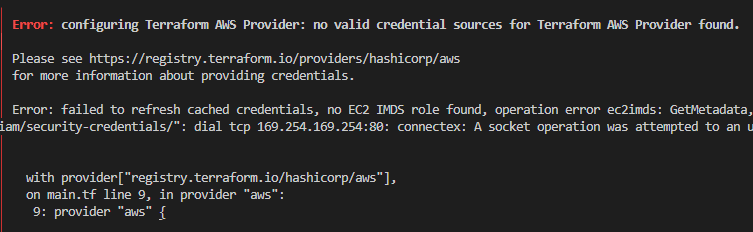

# Tech 201 Terraform

## Installing Terraform
Video guide: https://www.youtube.com/watch?v=SkcRSJWNRS8

We can verify if Terraform is installed by running `terraform --version`

We expect
```
Terraform v1.3.9
on windows_amd64
```

## Using Terraform 


To use Terraform we create a configuration file, `main.tf`.

Note: Ensure to install Terraform extensions on VS Code


In `main.tf` we will write code to launch an EC2 Instance on AWS:
```ruby
# launch ec2
# which cloud provider - AWS
# terraform downloads required dependencies -
# terraform init 

provider "aws" {
    region = "eu-west-1"

}

# MUST OPEN NEW GITBASH AS ADMIN AFTER ENV VAR SET UP
# launch an instance
resource "aws_instance" "app_instance" {
    ami = "ami-0f69657a120c6f174"
    instance_type = "t2.micro"
    associate_public_ip_address = true
    tags = {
        Name = "tech201-iwan-terraform-app"
    }
}
```
To install the dependencies required to launch an instanc on AWS we run `terraform init`. Once this is done we can run the following

```
terraform plan
```
This creates an execution plan, which lets you preview the changes that Terraform plans to make to your infrastructure. When Terraform creates a plan it:
- Reads the current state of any already-existing objects to ensure the Terraform state is up-to-date
- Compares the current configuration to the prior state and noting any differences
- Proposes a set of change actions that should make the remote objects match the configuration.

It is important that AWS access keys are saved properly to your machine's environment variables (User variables specifically) in advanced system settings on your local machine. If we don't have the correct access we may get the following when running `terraform plan`



Note you may just need to open a new bash terminal (AS ADMIN) to get this working.

If everything looks alright we execute our Terraform plan by running
```
terraform apply
```
In this case we should see our EC2 Instance launched as specified in our file `main.tf`

And should we wish to terminate our EC2 instance we run:
```
terraform destroy
```
## Deploying an Infrastructure on AWS with Terraform

```ruby
# launch ec2
# which cloud provider - AWS
# terraform downloads required dependencies -
# terraform init 

provider "aws" {
    region = "eu-west-1"

}

# MUST OPEN NEW GITBASH AS ADMIN AFTER ENV VAR SET UP

# create a VPC
resource "aws_vpc" "iwan_vpc" {
    cidr_block = "10.0.0.0/16"

    tags = {
        Name = "tech201_iwan_terraform_vpc"
    }
}
# Subnets and IG
resource "aws_subnet" "public" {
    vpc_id = var.iwan_vpc_id
    cidr_block = "10.0.0.0/18"

    tags = {
        Name = "tech201_iwan_terraform_public_sn"
    }
}
resource "aws_subnet" "private" {
    vpc_id = var.iwan_vpc_id
    cidr_block = "10.0.240.0/20"

    tags = {
        Name = "tech201_iwan_terraform_private_sn"
    }
  
}
resource "aws_internet_gateway" "ig" {
    vpc_id = var.iwan_vpc_id

    tags = {
        Name = "tech201_iwan_terraform_ig"
    }
  
}
# Route Table(s)
resource "aws_route_table" "public_rt" {
    vpc_id = var.iwan_vpc_id

    route {
        cidr_block = "0.0.0.0/0"
        gateway_id = var.iwan_ig_id
    }

    tags = {
        Name = "tech201_iwan_terraform_rt_public_access"
    }
}
resource "aws_route_table_association" "public_access" {
    subnet_id = var.public_sn_id
    route_table_id = var.rt_public_id
}

# Security group
resource "aws_security_group" "app_sg" {
    name = "app_sg"
    description = "Allow connections from port 22, 80 and 3000"
    vpc_id = var.iwan_vpc_id

    ingress {
        from_port = 80
        to_port = 80
        protocol = "tcp"
        cidr_blocks = ["0.0.0.0/0"]
    }
    ingress {
        from_port = 22
        to_port = 22
        protocol = "tcp"
        cidr_blocks = ["0.0.0.0/0"]
    }
    ingress {
        description = "Allow our Node app to listen on port 3000"
        from_port = 3000
        to_port = 3000
        protocol = "tcp"
        cidr_blocks = ["0.0.0.0/0"]
    }
    egress {
        from_port = 0
        to_port = 0
        protocol = "-1"
        cidr_blocks = [ "0.0.0.0/0" ]
    }
    tags = {
        Name = "tech201_iwan_terraform_app_sg"
    }
}
# launch an instance
resource "aws_instance" "app_instance" {
    ami = var.app_ami_id
    instance_type = "t2.micro"
    associate_public_ip_address = true
    key_name = var.key
    subnet_id = var.public_sn_id
    vpc_security_group_ids = [var.vpc_sg_id]
    tags = {
        Name = var.instance_name
    }
}
```